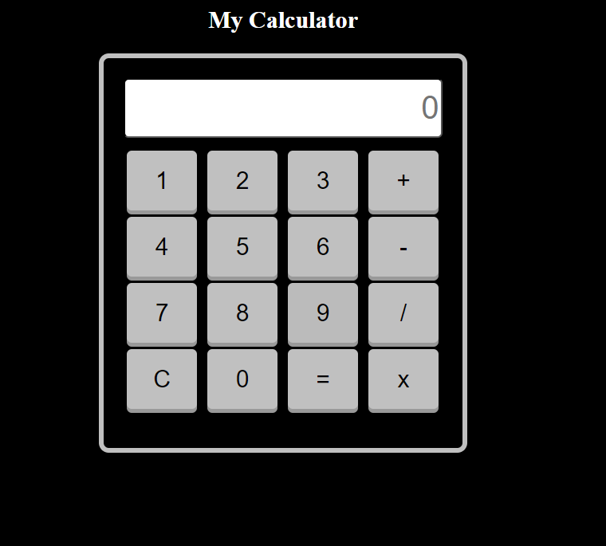
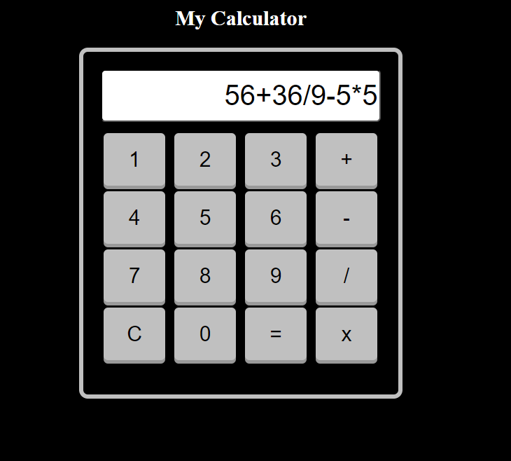
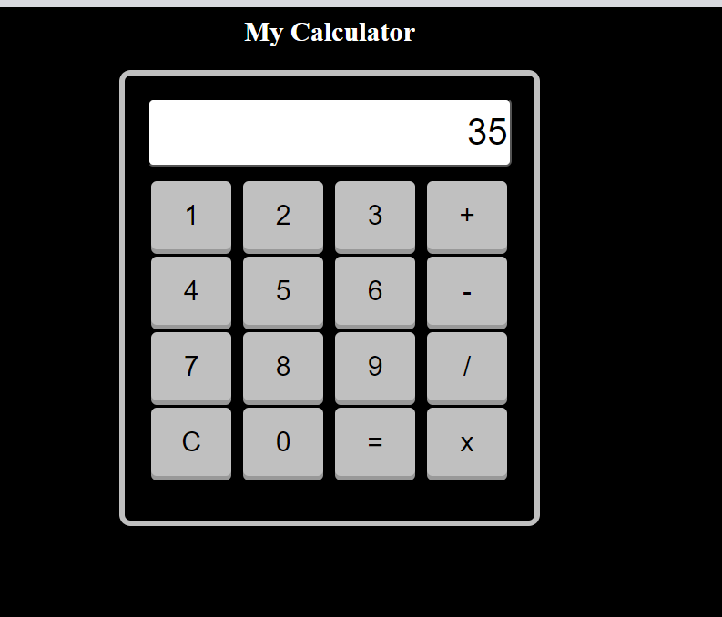

# Simple Calculator 

This project is a simple web-based calculator designed to resemble a real calculator. It is built using HTML, CSS, and JavaScript.

## Features

- Basic arithmetic operations: addition, subtraction, multiplication, and division.
- Clear button to reset the input.
- Realistic calculator design with a black outline and responsive buttons.

## Preview

Preview of calculator

Calculator performing various aritmetic operations

Calculator showing the answer of evaluated expression

## Usage

To use the calculator, simply open the 

## Contact

If you have any questions, suggestions, or feedback, feel free to reach out at nehaannie2002@gmail.com
